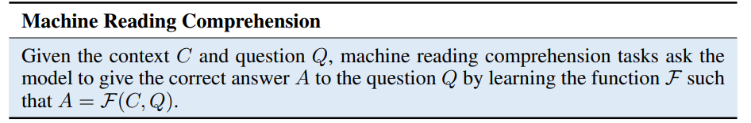
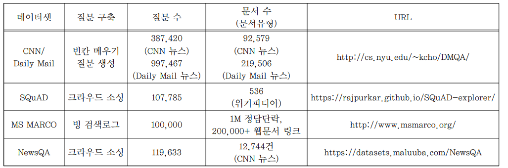
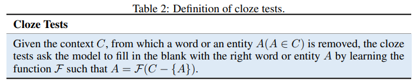
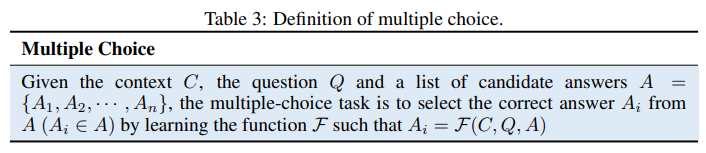
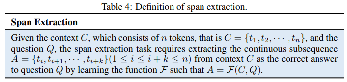
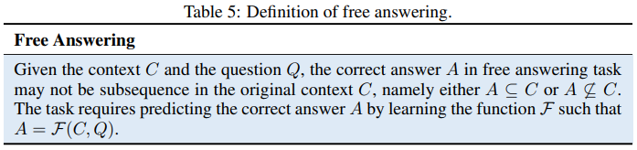

## M**RC research trends**

- MC(Machine Comprehension) : answering a query about a given context paragraph
    * 문장(context)의 흐름을 이해하고, 주어진 문장(context)에서 질문(query)에 대답하는 것.
    * query와 context의 복잡한 상호 관계를 이해해야함
    * ex) Context : 미소는 희서에게 1000원을 주었다. 희서는 현성이에게 다시 1000원을 주었다.
    * ex) Query : 동영이가 가진 돈은?

- Machine Reading Comprehension이란 주어진 문서와 문서에 대한 질문이 주어졌을 때, 문서내에서 최적의 답안을 구해내는 기술을 의미한다.

- MRC의 지향점은 QA 서비스라고 할 수 있다. 기존 검색은 DB에서 데이터를 찾고 키워드를 기반으로 한 리스트를 제공하는 방식이었다. QA 서비스는 이러한 방식을 넘어 정형 데이터든 비정형 데이터든 다양한 데이터 속에서 키워드 기반이 아니라 사용자의 의도를 분석해 원하는 답을 찾아준다. 즉 비정형 데이터에서 질문에 적합한 답을 찾는 QA의 핵심 기술이라고 할 수 있다. MRC는 나온지 몇 년 안된 기술이기 때문에 타 자연어 처리 서비스보다 빠르게 발전하고 있으나 사람의 능력을 따라가기에 다소 부족한 점이 많다.

- 최근 Attention 모델을 결합한 MRC에서 활용되었다.
    * 문맥의 작은 부분에 집중 가능하며, 그 정보를 fixed-size vector로 표현함.

- 초기 MRC 시스템은 1970년대 Lehner의 QUALM system에서 처음으로 제안되었다.

- 그러나 작은 데이터 사이즈와 특정 도메인의 한계에 부딪혀 1980년대와 1990년대 널리 적용되지 못했다. 이후 1999년 Hirschman과 연구진은 5개의 “wh”(what, where, when, why, and who)질문과 함께 3 부터 6등급의 내용이 담긴 데이터 세트를 발표했고 다시 MRC 연구가 수면위로 부상했다.

- 하지만 당시 MRC task를 해결하는 연구는 주로 rule-based과 machine-learning 기반으로 이루어졌다. 질문과 context가 있는 문장을 단어 집합으로 나타내는 bag-of-words기법이 적용되었고 문맥과 문맥사이에서 나타나는 모든 단어를 정답으로 설정했다.

- 이후 Riloff와 연구진은 Quarc라는 rule-based 기반 MRC 시스템을 구축, Poon과 연구진은 machine-learning method에 bootstrapping, Markov logic 그리고 self-supervised learning을 적용해 machine reading 문제를 해결했다.

- 하지만 앞서 제시한 방법론의 경우 모두 몇가지 제한이 걸린다. Mainly based on hand-crafted rules이나 features들은 사람이 직접 구현해야하기 때문에 상당한 cost가 소모된다. 또한 다양한 데이테 일반화하여 적용할 수 없으며, large-scaled datasets에서 제대로 효과를 보일 수 업다. 그리고 long-range dependencies가 무시될 뿐만 아니라 extract contextual information 역시 제대로 반영되지 못한다.

- 이렇게 사람이 직접 구현하는 small size of human-generated datasets 및 machine-learning based method의 한계로 인해 MRC 성능이 좋지 않아 어플리케이션 적용이 어려웠다.

- 2015년 이후 상황이 바뀌게 되었는데 두 가지 요인이 작용했다. 하나는 Deep learning 기반의 MRC가 등장한 점이다. contextual information을 포착하는데 우수한 성능을 보이게 되었다. 다른 하나는 대형 데이터세트가 등장한 점이다. 대표적으로 CNN & Daily Mail, Stanford Question-Answering Dataset(SQuAD), MS MARCO가 있다.

- 대규모 데이터 세트와 deep neural architectures의 결합을 통해 MRC 연구가 폭발적으로 늘어났고 성능 또한 대폭 향상되었다. 또한 MRC task의 다양성도 확대되고 있다.

- MRC의 가장 기본적인 task는 textual question answering이다. 질문과 관련된 문맥에서 정답을 찾아내는 것을 의미한다. MRC의 주 목적은 주어진 맥락에서 정답을 추출하거나 상황에 따라 더 복잡한 정답을 생성하는 것이다. MRC는 사람과 기계 사이의 자연어 이해 격차를 해소하겠다는 목표를 갖고 있다.

- 초기 QA는 그래프 형태로 질문과 답변을 만든 후 그래프 매칭을 시켜서 원하는 질문에 답변을 하게 만들었다. 문장이 심플하지 못하고 정규화된 형태가 나오지 않으면 성능이 크게 떨어졌다.

- Open-domain QA vs. closed-domain QA
    + When we think about QA systems we should be aware of two different kinds of systems: open-domain QA (ODQA) systems and closed-domain QA (CDQA) systems.

    + Open-domain systems deal with questions about nearly anything, and can only rely on general ontologies and world knowledge. One example of such a system is DrQA, an ODQA developed by Facebook Research that uses a large base of articles from Wikipedia as its source of knowledge. As these documents are related to several different topics and subjects we can understand why this system is considered an ODQA.

    + On the other hand, closed-domain systems deal with questions under a specific domain (for example, medicine or automotive maintenance), and can exploit domain-specific knowledge by using a model that is fitted to a unique-domain database. The cdQA-suite was built to enable anyone who wants to build a closed-domain QA system easily.

- MRC QA를 이해하기 위해서 IR-based QA의 원리를 선행학습할 필요가 있다. (Information Retrieval, 정보 검색일나 구조화되니 않은 텍스트데이터를 찾는 작업을 말함. 정보 검색에는 정답이 없기 때문에 Relevant라는 표현을 사용.)
    + Query Processing
        - Query Formulation(명사 동사를 뽑음)
        - Answer Type Detection(해당 질문은 어떤 답변 타입을 원하는지 찾음)
    + Passage Rtrieval
        - Document Retrieval(질문과 관련있는 문서를 찾음. 상위 몇 개만 임의로 선택)
        - Passage Retrieval(단락 단위로 자름, 단락을 다시 랭킹화, 거기서 상위 몇 개 선택)
    + Answer Processing
        - 정답 위치를 찾아두고 Answer Type Detection을 기반으로 정답을 랭킹화 시킴.

- IR-based Question Processing
    + Answer type Detection
    + Query Formulation
    + Question Type classification
    + Focus Detection
    + Relation Extraction

- IR-based Answer Processing
    + passage 에서 후보군을 찾은 상태에서 랭킹화 하는 단계
    + ex) Q : Who was Queen Victorias second son? at:person
    + Feature for ranking
            - Answer type match
            - Pattern match
            - Question keywords
            - keywords
            - Novelty factor
            - Approsition features
            - Puncuation location
            - Sequences of question terms

- MRC Processing
    + 주어진 문서를 기계가 이해하고 관련 질문에 답변을 하는 시스템, IR-based, KB-based 방식은 feature를 찾는 과정이 어려우므로 그것을 Deep learning을 결합해 해결하자는 입장에서 등장
        1. 기계가 글과 질문을 읽고
        2. 추론을 하며(답이 나올만한 pattern을 학습)
        3. 글에서 정답을 찾아주는 것(위치)

- Bidirectional Attention Flow(Seo et al., 2017) - Minjoon Seo
    1. 문서의 단어와 질문의 단어를 가져옴
    2. Glove, char-CNN(oov 문제를 위해 Char로 쪼개서 임베딩)
    3. Bi-Directional RNN(문맥을 파악)
    4. Co Attention Layer, Q2A, C2Q 두 개의 Attention 사용(문서와 질문의 각 단어들 간의 연관성을 학습)

- R-Net
    + Self-Attention이 추가됨

### MRC TASKS

- 기계가 다양한 주제의 글을 읽어서 뚯을 이해하고, 읽은 글에 대한 이해력을 평가하기 위한 질의응답 기술 개발을 위해  질문-정답-정답단락의 트리플로 구성된 대규모 데이터세트가 공개되고 있다. Computer Vision 분야에서는 1,000개의 분류된 객체에 대해 1천 5백만장의 태깅된 데이터세트가 제공되어 Computer Vision 연구와 기술향상이 늘어나는데 큰 기여를 한 사례가 있다.

- Stanford는 물론 Google과 Microsoft에서도 질문에 포함된 단어 및 단어들의 어순을 매칭하여 정답을 추론하는 기존의 QA 수준에서 탈피하기 위해, 기계가 글을 읽고 문맥을 이해하는 Machine Reading, 읽은 글의 이해정도를 평가하기 위한 Question Answering을 Deep learning을 결합하고 있으며 어휘와 문장 단계에서 나아가 MRC 단계로 들어갔다. 2015년도부터 축적된 대표적인 QA 데이터는 SQuAD, CNN&Daily Mail, MS MARCO가 있으며 WikiQA, Machine comprehension Test, CBT, BookTest가 있다.

- 현재 MRC Task는 크게 네 가지로 구분할 수 있고 Task에 부합되는 데이터 세트를 정리하면 다음과 같다.

1. Cloze Tests
    + CNN & Daily Mail(Google Deepmind & University of Oxford, 2015)
2. Multiple Choice
    + RACE
3. Span Extraction
    + SQuAD
4. Free Answering
    + MS MARCO

##### CNN & Daily Mail
- Google Deepmind는 2007년 4월부터 2015년 4월까지 미국 CNN 뉴스기사와 2010년 6월부터 2015년 4월까지 영국 Daily Mail 뉴스기사를 각각 수집함.
- 정답이 들어있는 문서 셋은 총 312,085건.
- 원본 문서에 나타나는 entity(단어 또는 구/절)들을 익명화하여 변환 후, X로 명기된 entity를 찾는 질문셋 1,384,887건을 구축함.
- 하지만 entity에 대한 빈칸 채우기 문제 Colze test는 독해력이 낮아 MRC 판별에 변별력이 낮다는 지적이 있음.

##### RACE
- 중국 영어 시험에서 수집된 데이터세트.
- 28,000 이상의 passages와 약 100,000개의 question이 포함되어 있음.

##### SQuAD
- Stanford에서 2016년 Wikipedia 문서 536건을 대상으로 107,785건의 질문을 크라우드 소싱을 통해 만듬.
- 정답을 추출하는데 사용되는 정답 단락은 4-5개의 문장으로 구성되어 QA문제로 단락이 너무 짧다는 문제가 제기 된 바 있음.
- 현재 가장 보편적으로 사용되고 있는 데이터세트.

##### MS MARCO
- MS는 기존에 구축된 CNN/Daily Mail, SQuAD 등의 데이터셋이 정답단락에 기술된 단어를 사용하고 어순도 유사하다는 문제점을 탈피하기 위해, 사용자가 실제 질문하는 문장과 정답단락이 다르게 표현(예: 오자, 약어, 패러프 레이징 등의 사용)되는 실제적인 독해력에 데이터셋을 구축하고자 함.
- 빙 검색엔진 사용자 로그로부터 100,000건의 질문을 구축하였으며, 1백만건의 정답단락은 실제 웹문서로부터 추출 하여 2십만건 이상의 웹문서와 연결시켜 구축.

##### SQuAD example
- _Context_ : Computational complexity theory is a branch of the theory of computatin in theoretical computer science that focuses on classifying computational problems according to their inherent difficulty, and relating those classes to each other. A computational problem is understood to be a task that is in principle amenable to being solved by a computer, which is equivalent to stating that the problem maybe solved by mechanical application of mathematical steps, such as an algorithm.

- _Question_ : By what main attribute are computationla problems classified using computational complexity theory?

- _Answer_ : inherent difficulty

### General architectures
- Embedding
- Feature Extraction
- Context-Question Interaction
- Answer Prediction

    + Embedding : 기계가 자연어를 직접 이해할 수 없기 때문에 MRC 시스템 시작 시 입력 단어를 고정 길이 벡터로 변경하는 임베딩 필요. context와 question을 input으로 사용하여 context와 question에 대한 embedding 값을 출력함.

    + Feature Extraction : context와 question을 더 잘 이해하기 위해 contextual information을 추출하는 것을 목표로함.

    + Context-Question Interaction : context와 question의 상관관계는 답을 예측하는데 있어 중요한 역할을 함. 이런 정보를 통해 기계는 질문에 대단하는데 어떤 context 부분이 주요하게 작용하는지 알아낼 수 있음. 둘 사이의 interaction을 추츨을 위해 query와 관련된 context의 일부를 강조하기 위한 단방향 혹은 양방향 attention mechanism이 활용됨.

    + Answer Prediction : MRC system의 마지막 요소로 이전 모듈들의 정보 연산을 통해 획득한 final answer을 output으로 출력함. task에 따라서 별개로 적용됨. Cloze Task의 경우 output이 original context 속 word 또는 entity가 됨. free answering task의 경우 generation techniques가 활용되기도 함.

#### Typical Deep-Learning methods
- traditional rule-based method나 machine-learning method와 비교했을 때, deep-learning techniques는 주요한 contextual information을 추출하는데 있어 우월성을 보인다.

## R**eferences**

- [A STUDY OF THE TASKS AND MODELS IN MACHINE READING COMPREHENSION](https://arxiv.org/pdf/2001.08635.pdf)
- [Neural Machine Reading Comprehension: Methods and Trends](https://arxiv.org/pdf/1907.01118.pdf)
- [BI-DIRECTIONAL ATTENTION FLOW FOR MACHINE COMPREHENSION, 2017](https://arxiv.org/pdf/1611.01603.pdf)
- [LG sciencepark Korean MRC Demo](http://35.226.109.43:8000/)

#### 18-19 Language representation models
|발표날짜|모델|저자|
|------|---|---|
|2018/02|ELMo|Allen AI & UW|
|2018/05|GPT-1|OpenAI|
|2018/10|BERT|Google|
|2019/07|XLNet|CMU & Google Brain|
|2019/07|RoBERTa|Facebook AI Reaserch, FAIR|
|2019/09|ALBERT|Google & TTIC|
|2019/10|T5|Google|
